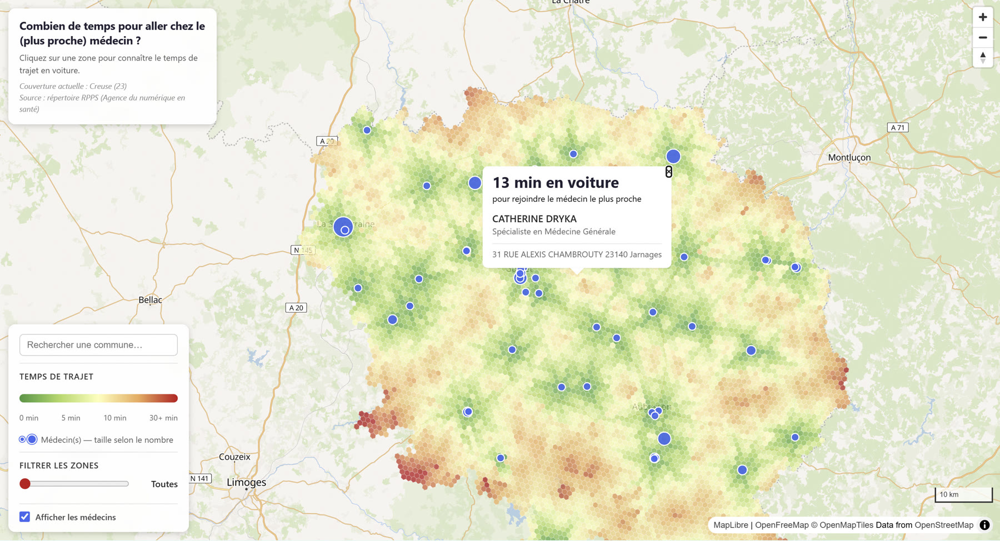
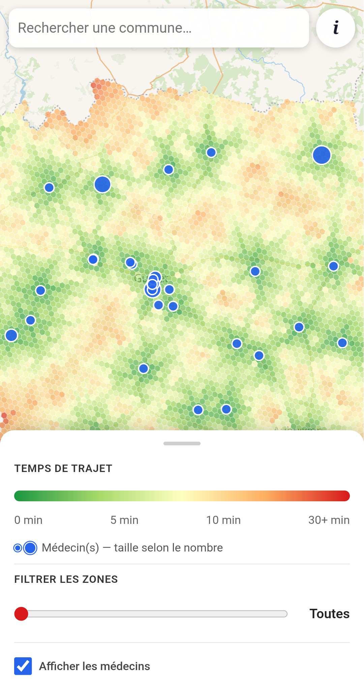
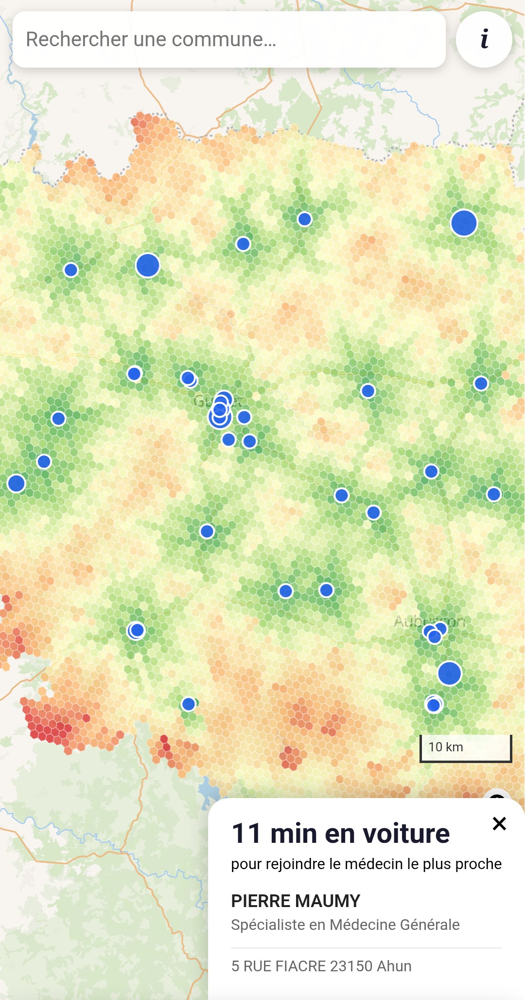

# MedMap

### 🗺️ [Voir la carte en ligne → medmap.stephanelong.fr](https://medmap.stephanelong.fr)

Cartographie de l'accessibilité aux médecins généralistes dans la **Creuse (23)**. Le projet calcule, pour chaque hexagone d'une grille H3 couvrant le département, le temps de trajet en voiture jusqu'au généraliste le plus proche, et restitue le résultat sur une carte interactive.



<p align="center">
  
  &nbsp;&nbsp;
  
</p>

<p align="center"><em>La même carte sur mobile : panneau de contrôle repliable, et détail au tap sur une zone.</em></p>

> **Projet de démonstration.** MedMap est un exercice personnel de cartographie web et de traitement de données géospatiales, réalisé de bout en bout : collecte, géocodage, calcul d'itinéraires, publication d'une carte interactive. Ce n'est **pas un service destiné au public** ni un outil d'aide à la décision : les données ne sont pas mises à jour automatiquement, et l'indicateur produit est volontairement simple (voir *[Ce que la carte montre — et ce qu'elle ne montre pas](#ce-que-la-carte-montre--et-ce-quelle-ne-montre-pas)*). L'objectif est de démontrer la chaîne technique et la démarche, pas de mesurer l'accès aux soins en Creuse avec la rigueur qu'exigerait une publication.

Développé initialement sur l'Essonne (91), puis migré vers la Creuse — un département où la question de la démographie médicale se pose avec une acuité particulière, et dont la faible densité rend le contraste urbain/rural lisible sur une carte.

## Aperçu du fonctionnement

1. Un pipeline **Python** géocode les praticiens, génère une grille hexagonale H3 sur le département, puis calcule les temps de trajet via un serveur de routage **OSRM** local.
2. Le résultat est exporté en **GeoJSON**.
3. Un frontend **Vite + MapLibre GL JS** (site statique, sans backend) affiche la carte interactive, avec une interface adaptée au mobile (panneau de contrôle en *bottom sheet* repliable sous 768px).

Pour le détail pas-à-pas de chaque étape (avec remarques et pièges connus), voir **[`process.md`](process.md)** — qui contient aussi un glossaire des technologies utilisées (GeoJSON, H3, OSRM, GeoPandas, MapLibre GL JS, Vite, WGS84...).

## Ce que la carte montre — et ce qu'elle ne montre pas

La carte répond à une question précise et étroite : **« en partant d'ici, combien de temps de voiture jusqu'au cabinet de généraliste le plus proche ? »**. C'est un indicateur de distance-temps, pas une mesure de l'accès réel aux soins. Les limites suivantes sont assumées et connues.

**La voiture est le seul mode de transport modélisé.** C'est la limite la plus lourde : elle passe à côté des personnes sans véhicule — âgées, précaires, non motorisées — c'est-à-dire précisément celles pour qui l'éloignement pose le plus problème en zone rurale. Une carte des temps de trajet en transports en commun donnerait un résultat très différent, et probablement plus parlant.

**Un cabinet proche n'est pas un médecin disponible.** Le calcul ignore tout ce qui détermine l'accès effectif : médecins ne prenant plus de nouveaux patients, délais de rendez-vous, exercice à temps partiel, pyramide des âges des praticiens et départs en retraite à venir. Deux territoires affichant le même temps de trajet peuvent avoir des réalités opposées.

**Aucune pondération par la population ou la patientèle.** L'indicateur traite de la même façon un cabinet isolé et un pôle de santé de six médecins. L'indicateur de référence sur le sujet, l'**APL** (Accessibilité Potentielle Localisée, publié par la DREES), croise offre, demande et distance — il est méthodologiquement bien plus solide que ce qui est calculé ici.

**Effet de bord aux frontières du département.** Les praticiens sont filtrés sur les codes postaux de la Creuse, et le graphe routier OSRM est construit sur le seul extrait OSM du département. Un habitant proche d'une limite départementale peut donc se voir attribuer un temps de trajet surestimé, alors qu'un médecin plus proche existe côté Indre, Cher, Allier, Puy-de-Dôme, Corrèze ou Haute-Vienne.

**Conditions de circulation théoriques.** OSRM calcule sur des vitesses libres, sans trafic, sans météo, sans saisonnalité, et sans tenir compte de l'état réel des routes secondaires.

**Instantané, non actualisé.** Les données sont figées à la date d'extraction du répertoire RPPS ; la carte ne montre aucune évolution dans le temps. Le géocodage des adresses est automatique et n'a pas fait l'objet d'une reprise manuelle : quelques cabinets peuvent être mal positionnés.

## Pistes d'approfondissement

Par ordre d'intérêt journalistique décroissant :

- **Croiser avec la démographie** — superposer la population par tranche d'âge permettrait de passer d'une carte de surfaces à une carte de personnes concernées, et de chiffrer combien d'habitants vivent à plus de 20 minutes d'un médecin.
- **Intégrer l'âge des praticiens** pour projeter les départs en retraite et cartographier non pas la situation actuelle, mais celle qui s'annonce.
- **Ajouter les transports en commun** (données GTFS) afin de traiter la limite principale décrite ci-dessus.
- **Élargir aux départements limitrophes** pour supprimer l'effet de bord.
- **Comparer plusieurs départements** — la migration Essonne → Creuse a été faite précisément pour vérifier que le pipeline est transposable.

## Structure du repo

```
src/                          # Pipeline de traitement des données (Python)
├── 01_extract_praticiens.py  # Géocodage des adresses (api-adresse.data.gouv.fr)
├── 02_generate_grid.py       # Grille H3 sur le département (geo.api.gouv.fr)
├── 03_compute_matrix.py      # Calcul des temps de trajet (OSRM)
├── 04_export_geojson.py      # Export de la grille d'accessibilité en GeoJSON
├── 05_export_praticiens.py   # Export des cabinets/praticiens en GeoJSON
└── import_praticiens.py      # Exploration/parsing des données brutes

client/                       # Frontend statique (Vite + MapLibre GL JS)
├── index.html
├── src/                      # main.js (carte, couches, interactions), style.css
└── public/                   # GeoJSON générés + assets statiques

data/                         # Données (ignoré par Git, sauf CSV sources)
import_praticiens.ipynb       # Notebook d'exploration/préparation des données brutes
setup_osrm_creuse.bat         # Setup Docker OSRM — Creuse
process.md                    # Notes détaillées de workflow + glossaire technique
```

## Prérequis

- **Python 3** avec un environnement virtuel (`.venv/`)
- **Node.js** + npm (pour le frontend)
- **Docker Desktop** (pour le serveur de routage OSRM)

### Dépendances Python

```bash
pip install -r requirements.txt
```

Pour ouvrir `import_praticiens.ipynb` (étape 1, préparation du CSV brut), Jupyter n'est pas inclus dans `requirements.txt` — installer séparément si besoin (`pip install jupyterlab` ou via l'extension Jupyter de votre IDE).

## Mise en route

### 1. Pipeline de données

```bash
# Activer le venv
.venv\Scripts\activate          # Windows
source .venv/bin/activate       # Linux/Mac

# Géocoder les praticiens
python src/01_extract_praticiens.py

# Générer la grille H3 sur la Creuse
python src/02_generate_grid.py

# Démarrer OSRM (Docker) — nécessaire avant l'étape suivante
./setup_osrm_creuse.bat

# Calculer les temps de trajet
python src/03_compute_matrix.py

# Exporter les GeoJSON pour le frontend
python src/04_export_geojson.py
python src/05_export_praticiens.py
```

Copier ensuite les GeoJSON générés (`data/praticiens.geojson`, `data/grille_accessibilite_creuse.geojson`) dans `client/public/` (voir `process.md` pour le détail des noms de fichiers attendus).

### 2. Frontend

```bash
cd client
npm install
npm run dev       # serveur de dev, http://localhost:5173
```

Le script `dev` inclut `--host` : Vite affiche aussi une URL « Network »
(`http://<IP-locale>:5173`) permettant de tester depuis un smartphone connecté
au même Wi-Fi. Depuis le téléphone, `localhost` ne fonctionne pas — il désigne
le téléphone lui-même, il faut bien saisir l'adresse IP du poste de dev.

`npm run build` génère un site statique dans `client/dist/`, prêt à héberger (déploiement actuel : hébergement mutualisé OVH).

## Changer de département

Les chemins de fichiers et filtres géographiques (code département) sont codés en dur dans les scripts — voir la section *Points de vigilance* de `process.md` pour la liste exhaustive des endroits à adapter (scripts `01`, `02`, `05`, ainsi que `client/index.html` et `client/src/main.js`).

## Infrastructure cible (non encore implémentée)

Backend PostGIS + Martin Tile Server sur NAS Synology, reverse proxy Cloudflare Tunnels. Le frontend actuel (GeoJSON statique) est une première itération volontairement simple.
